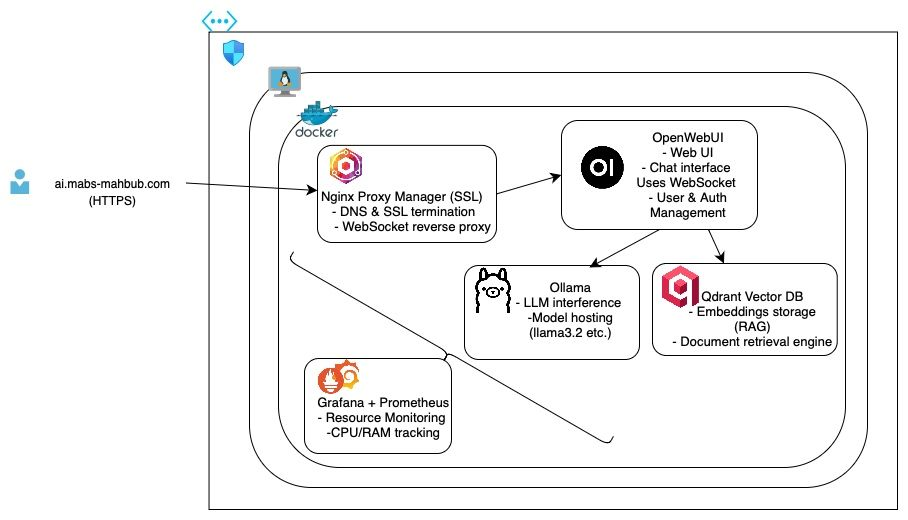
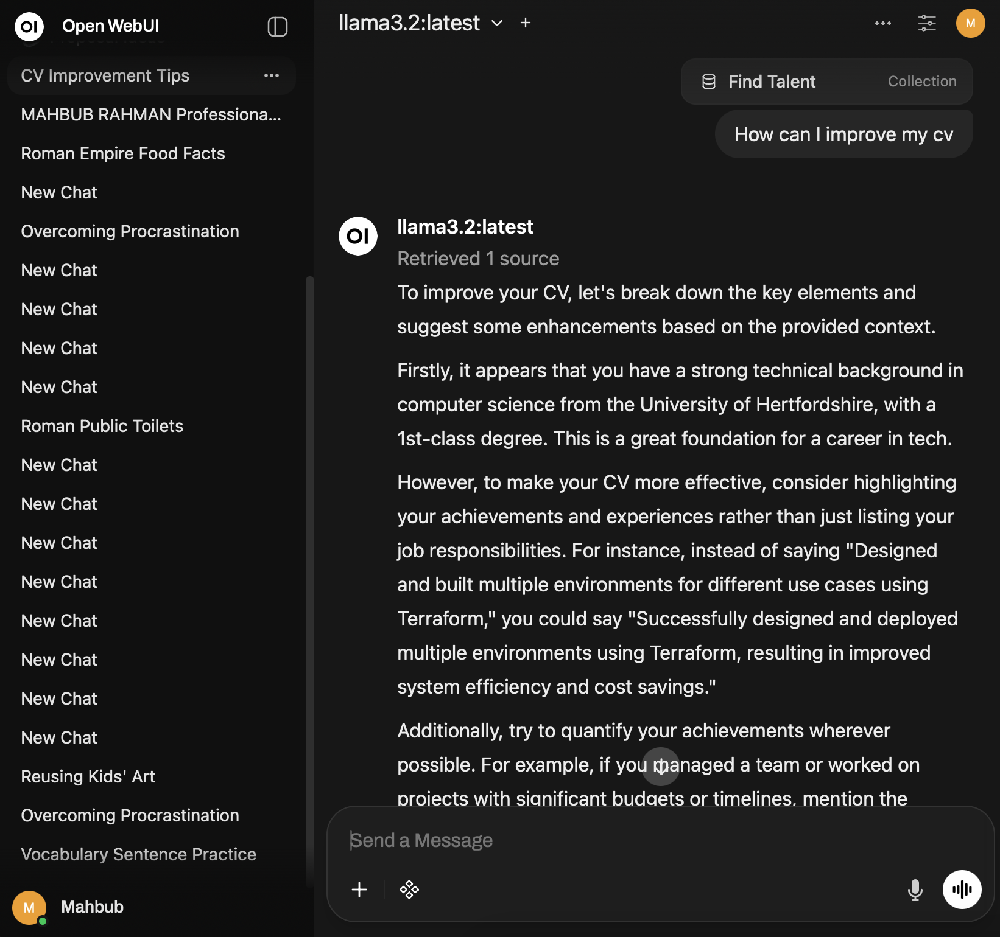

# Self-Hosted AI Platform

This repository provides a self-hosted AI stack on Azure. The intended flow is: provision Azure infrastructure with Terraform, then bootstrap the VM, and finally deploy the Docker Compose stack (optionally via the provided scripts).

## What's Included

- **Ollama** for local model serving.
- **Open WebUI** for chat and RAG workflows.
- **Qdrant** as the vector database.
- **Nginx Proxy Manager** for easy reverse-proxy configuration.
- **Grafana + Prometheus (optional)** for monitoring.


## 📸 Screenshots

### Architecture - Infrastrcuture Design


### Site Page


## Prerequisites

- Terraform `>= 1.6.0`
- An Azure subscription and authenticated CLI (`az login`)
- A public SSH key for VM access

## Azure Deployment Flow

### 1) Provision Azure Infrastructure (Terraform)

The `terraform/` directory provisions an Azure VM and uses cloud-init to install Docker, clone this repo, and start the Compose stack.

```bash
cd terraform
cat <<'EOF' > terraform.tfvars
rg_name             = "ai-platform"
admin_ip_cidr       = "YOUR_IP/32"
ssh_public_key_path = "~/.ssh/id_rsa.pub"
repo_url            = "https://github.com/your-org/self-hosted-ai.git"
EOF

terraform init
terraform apply
```

Terraform outputs the VM public IP. Once provisioning completes, the VM should already be running the core Compose stack via cloud-init.

### 2) Deploy or Re-deploy the Compose Stack (VM)

If you need to re-deploy manually, SSH to the VM and use the deploy script:

```bash
ssh <admin_user>@<vm_public_ip>
export GRAFANA_ADMIN_PASSWORD="change-me"
sudo /opt/ai-platform/scripts/deploy.sh
```

> Update the placeholder GitHub repo URL inside `scripts/deploy.sh` before running it.

### 3) Optional: Monitoring Stack (VM)

To run Grafana + Prometheus on the VM:

```bash
cd /opt/ai-platform/compose/monitoring
export GRAFANA_ADMIN_PASSWORD="change-me"
docker compose up -d
```

Grafana is available at `http://<vm_public_ip>:3001`.

## Configuration Notes

- **Open WebUI** is configured to use Ollama and Qdrant out of the box. See `compose/docker-compose.yaml` for the full list of environment variables.
- **Grafana credentials**: user is `admin` and the password is set by `GRAFANA_ADMIN_PASSWORD`.
- **Ports**
  - Open WebUI: `3000`
  - Ollama: `11434`
  - Qdrant: `6333`
  - Nginx Proxy Manager: `80`, `81`, `443`
  - Grafana: `3001`

## Updating

Pull new images and restart the stack on the VM:

```bash
cd /opt/ai-platform/compose
docker compose pull
docker compose up -d
```

## Troubleshooting

- Check container logs: `docker compose logs -f <service>`
- Ensure your VM has sufficient RAM/CPU for the models you plan to run in Ollama.
